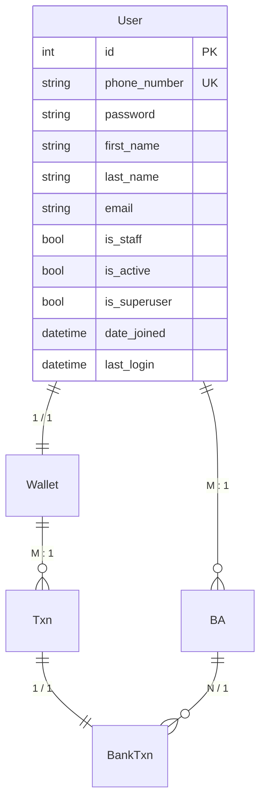

# Ledger Project

A **ledger app**: users have one wallet, can link many bank accounts, and every money movement is recorded as a transaction.

Django 6 + Django REST Framework API. Python **3.12**, packages managed with **uv**, PostgreSQL via **Docker Compose**.

---

## Data model




| Entity      | Meaning                                                            |
| ----------- | ------------------------------------------------------------------ |
| **User**    | Account holder                                                     |
| **Wallet**  | One wallet per user                                                |
| **BA**      | Bank account — a user can have many                                |
| **Txn**     | Ledger transaction on a wallet                                     |
| **BankTxn** | Bank-side record of a wallet transaction, tied to one bank account |


| Relationship  | Cardinality |
| ------------- | ----------- |
| Wallet → User | 1 / 1       |
| BA → User     | M : 1       |
| Txn → Wallet  | M : 1       |
| BankTxn → Txn | 1 / 1       |
| BankTxn → BA  | N / 1       |


---

## Prerequisites

1. **Python 3.12** — `python3 --version`
2. **[uv](https://docs.astral.sh/uv/)** — `uv --version`
3. **Docker Desktop** (or Docker Engine + Compose) — `docker compose version`

---

## Start the project

Run every command from this folder (`ledger_project/`).

### 1. Install dependencies

```bash
uv sync
```

This creates `.venv` and installs Django, DRF, psycopg, bcrypt, and PyJWT from `pyproject.toml`.

### 2. Start PostgreSQL

```bash
docker compose up -d
```


| Setting         | Value                   |
| --------------- | ----------------------- |
| Container       | `ledgerdb`              |
| Database        | `ledgerdb`              |
| User / password | `postgres` / `postgres` |
| Port            | `5432`                  |


Django uses the same values in `config/settings.py`. Check the container:

```bash
docker compose ps
```

### 3. Apply migrations

```bash
uv run manage.py migrate
```

### 4. Create an admin user (optional)

```bash
uv run manage.py createsuperuser
```

### 5. Run the server

```bash
uv run manage.py runserver
```


| URL                                                          | What you get   |
| ------------------------------------------------------------ | -------------- |
| [http://127.0.0.1:8000/admin/](http://127.0.0.1:8000/admin/) | Django Admin   |
| [http://127.0.0.1:8000/api/](http://127.0.0.1:8000/api/)     | `user_app` API |


Stop the server with `Ctrl + C`. Stop the database with `docker compose stop`.

---

## Common commands


| Task                      | Command                            |
| ------------------------- | ---------------------------------- |
| Add a package             | `uv add <package>`                 |
| Create an app             | `uv run manage.py startapp <name>` |
| Make migrations           | `uv run manage.py makemigrations`  |
| Apply migrations          | `uv run manage.py migrate`         |
| Open a Django shell       | `uv run manage.py shell`           |
| Stop Postgres             | `docker compose stop`              |
| Stop and remove container | `docker compose down`              |
| Wipe DB volume            | `docker compose down -v`           |


Register new apps in `INSTALLED_APPS` in `config/settings.py`.

---

## Cursor / basedpyright

Select the project interpreter so imports resolve:

**Python: Select Interpreter** → `.venv/bin/python`

Then reload the window if Django / DRF still show as unresolved.